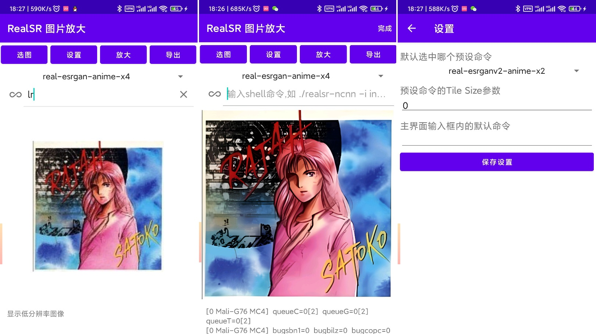

# RealSR-NCNN-Android

[English](https://github.com/tumuyan/RealSR-NCNN-Android/blob/master/README.md)

超分辨率是指将低质量压缩图片恢复成高分辨率图片的过程，用更常见的讲法就是放大图片并降噪。
随着移动互联网的快速发展，智能设备逐渐普及到生活的每个角落。随之而来的是大量的图像数据。有的图片本身分辨率就比较低，难以看清楚细节；有的在存储和传输的过程中，被反复压缩和劣化，最终不再清晰。
为了使用户获得更加高质量的视觉体验，或者出于更为基本的目的看清楚图片，图像恢复/超分辨率算法应运而生。而手机作为目前我们生活中最常使用的智能设备，显然有使用这一技术的迫切需求。

这个仓库就为安卓设备构建了一个囊括了常见ncnn超分模型的应用，具有如下特点：
  ✅ 内置算法和模型多。最初使用了[RealSR-NCNN](https://github.com/nihui/realsr-ncnn-vulkan)和[Real-ESRGAN](https://github.com/xinntao/Real-ESRGAN)的成果，后来又添加了[SRMD-NCNN](https://github.com/nihui/srmd-ncnn-vulkan)和[RealCUGAN-NCNN](https://github.com/nihui/realcugan-ncnn-vulkan)。  
  ✅ 支持图形界面和命令行两种操作方式使用。  
  ✅ 转换结果先预览，满意再导出，不浪费存储空间。  
  ✅ 导出文件自动按照模型和时间命名，方便管理。  
  ✅ 自定义优先选用的超分算法和模型。  
  ✅ 图片处理过程完全在本地运行，无需担心隐私泄漏、服务器排队、服务收费；处理耗时取决于图片大小以及设备的性能。  

### 下载地址 
[酷安](https://www.coolapk.com/apk/292197) 或 [Github Release](https://github.com/tumuyan/RealSR-NCNN-Android/releases)  

### 仓库结构
1. RealSR-NCNN-Android-GUI 可以编译出APK文件，这样用户可以在图形环境下操作。（不过他的本质就是在给命令行程序套壳，而不是通过JNI调用库文件）
2. RealSR-NCNN-Android-CLI 可以编译出RealSR-NCNN命令行程序，可以在安卓设备的Termux等虚拟终端中使用。这个程序可以使用RealSR和Real-ESRGAN的模型。
3. RealCUGAN-NCNN-Android-CLI 可以编译出SRMD-NCNN命令行程序，可以在安卓设备的Termux等虚拟终端中使用。
4. SRMD-NCNN-Android-CLI 可以编译出SRMD-NCNN命令行程序，可以在安卓设备的Termux等虚拟终端中使用。
5. Waifu2x-NCNN-Android-CLI 可以编译出Waifu2x-NCNN命令行程序，可以在安卓设备的Termux等虚拟终端中使用(由于技术和效果相对落后，考虑到应用的体积，这个程序未加入到GUI中)。

## 关于 Real-ESRGAN


Real ESRGAN是一个实用的图像修复算法，可以用来对低分辨率图片完成四倍放大和修复，化腐朽为神奇。
> [[论文](https://arxiv.org/abs/2107.10833)] &emsp; [[项目地址]](https://github.com/xinntao/Real-ESRGAN) &emsp; [[YouTube 视频](https://www.youtube.com/watch?v=fxHWoDSSvSc)] &emsp; [[B站讲解](https://www.bilibili.com/video/BV1H34y1m7sS/)] &emsp; [[Poster](https://xinntao.github.io/projects/RealESRGAN_src/RealESRGAN_poster.pdf)] &emsp; [[PPT slides](https://docs.google.com/presentation/d/1QtW6Iy8rm8rGLsJ0Ldti6kP-7Qyzy6XL/edit?usp=sharing&ouid=109799856763657548160&rtpof=true&sd=true)]<br>
> [Xintao Wang](https://xinntao.github.io/), Liangbin Xie, [Chao Dong](https://scholar.google.com.hk/citations?user=OSDCB0UAAAAJ), [Ying Shan](https://scholar.google.com/citations?user=4oXBp9UAAAAJ&hl=en) <br>
> Tencent ARC Lab; Shenzhen Institutes of Advanced Technology, Chinese Academy of Sciences


**现在的 Real-ESRGAN 还是有几率失败的，因为现实生活的降质过程比较复杂。**  

## 关于 RealSR
[[论文]](http://openaccess.thecvf.com/content_CVPRW_2020/papers/w31/Ji_Real-World_Super-Resolution_via_Kernel_Estimation_and_Noise_Injection_CVPRW_2020_paper.pdf) [[项目地址]](https://github.com/jixiaozhong/RealSR)  [[NTIRE 2020 Challenge on Real-World Image Super-Resolution: Methods and Results]](https://arxiv.org/pdf/2005.01996.pdf)

## 关于 SRMD
[[论文]](http://openaccess.thecvf.com/content_cvpr_2018/papers/Zhang_Learning_a_Single_CVPR_2018_paper.pdf) [[项目地址]](https://github.com/cszn/SRMD)


## 关于 Real-CUGAN
[[项目地址]](https://github.com/bilibili/ailab/tree/main/Real-CUGAN)
Real-CUGAN是一个使用百万级动漫数据进行训练的，结构与Waifu2x兼容的通用动漫图像超分辨率模型。

## 如何编译 RealSR-NCNN-Android-CLI
### step1
https://github.com/Tencent/ncnn/releases  
下载 `ncnn-yyyymmdd-android-vulkan-shared.zip` 或者你自己编译ncnn为so文件  
https://github.com/webmproject/libwebp  
下载libwebp的源码

### step2
解压 `ncnn-yyyymmdd-android-vulkan-shared.zip` 到 `../3rdparty/ncnn-android-vulkan-shared`  
解压libwebp源码到`app/src/main/jni/webp`

### step3
用 Android Studio 打开工程, rebuild 然后你就可以在 `RealSR-NCNN-Android-CLI\app\build\intermediates\cmake\debug\obj` 找到编译好的二进制文件


## 如何使用 RealSR-NCNN-Android-CLI
### 下载模型
我已经打包上传模型文件，当然你也可以自己从 RealSR-NCNN 和 Real-ESRGAN 的仓库下载模型。
`https://github.com/tumuyan/RealSR-NCNN-Android/releases/download/1.4.1/models.zip`

### 命令范例
确认程序有执行权限，然后输入命令：
```shell
./realsr-ncnn -i input.jpg -o output.jpg
```

### 完整用法
```console
用法: realsr-ncnn -i 输入的图片路径 -o 输出的图片路径 [其他可选参数]...

  -h                   显示帮助
  -v                   显示更多输出内容
  -i input-path        输入的图片路径（jpg/png路径或者目录路径）
  -o output-path       输出的图片路径（jpg/png路径或者目录路径）
  -s scale             缩放系数(默认4，即放大4倍)
  -t tile-size         tile size (>=32/0=auto, default=0) can be 0,0,0 for multi-gpu
  -m model-path        模型路径 (默认模型 models-Real-ESRGAN-anime)
  -g gpu-id            gpu设备序号 (默认0) 多GPU可选 0,1,2 但是应该不会有吧
  -j load:proc:save    解码/处理/保存的线程数 (默认1:2:2) 多GPU可以设 1:2,2,2:2
  -x                   开启tta模式
  -f format            输出格式(jpg/png, 默认ext/png)
```

## 如何编译 RealSR-NCNN-Android-GUI
下载模型和CLI程序，放置到如下路径, 然后使用 Android Studio 进行编译（我已经上传并assets.zip）

```
RealSR-NCNN-Android-GUI\app\src\main\assets\realsr
│  libncnn.so
│  libvulkan.so
│  realcugan-ncnn
│  realsr-ncnn
│  srmd-ncnn
│  
├─models-DF2K
│      x4.bin
│      x4.param
│      
├─models-DF2K_JPEG
│      x4.bin
│      x4.param
│      
├─models-nose
│      up2x-no-denoise.bin
│      up2x-no-denoise.param
│      
├─models-Real-ESRGAN
│      x4.bin
│      x4.param
│      
├─models-Real-ESRGAN-anime
│      x4.bin
│      x4.param
│      
├─models-Real-ESRGANv2-anime
│      x2.bin
│      x2.param
│      x4.bin
│      x4.param
│      
├─models-se
│      up2x-conservative.bin
│      up2x-conservative.param
│      up2x-denoise1x.bin
│      up2x-denoise1x.param
│      up2x-denoise2x.bin
│      up2x-denoise2x.param
│      up2x-denoise3x.bin
│      up2x-denoise3x.param
│      up2x-no-denoise.bin
│      up2x-no-denoise.param
│      up3x-conservative.bin
│      up3x-conservative.param
│      up3x-denoise3x.bin
│      up3x-denoise3x.param
│      up3x-no-denoise.bin
│      up3x-no-denoise.param
│      up4x-conservative.bin
│      up4x-conservative.param
│      up4x-denoise3x.bin
│      up4x-denoise3x.param
│      up4x-no-denoise.bin
│      up4x-no-denoise.param
│      
└─models-srmd
        srmdnf_x2.bin
        srmdnf_x2.param
        srmdnf_x3.bin
        srmdnf_x3.param
        srmdnf_x4.bin
        srmdnf_x4.param
        srmd_x2.bin
        srmd_x2.param
        srmd_x3.bin
        srmd_x3.param
        srmd_x4.bin
        srmd_x4.param
        		
```


## 如何使用 RealSR-NCNN-Android-GUI
支持两种操作方式:
1. 点击`选图`选择图片 - 点击`放大`（视图片大小和设备性能需要等待不同时间——毕竟原项目是使用电脑显卡运行的）- 查看放大效果是否满意，如果满意点击`导出`保存到相册。也可以在运行前切换使用的模型。切换模型后无需重新选择图片。
2. 直接在输入框内输入命令完成调用

## 截屏
输入和输出


## 本仓库中的其他工程
其他工程的编译和使用与RealSR-NCNN-Android-CLI完全相同，故不重复说明

## 感谢
### 原始超分辨率项目
- https://github.com/xinntao/Real-ESRGAN
- https://github.com/jixiaozhong/RealSR
- https://github.com/cszn/SRMD
- https://github.com/bilibili/ailab/tree/main/Real-CUGAN

### ncnn项目以及模型
大部分C代码都来自nihui。由于Android直接编译比较困难，必须对项目目录做调整，因此破坏了原有Git。  
- https://github.com/nihui/realsr-ncnn-vulkan 
- https://github.com/nihui/srmd-ncnn-vulkan
- https://github.com/nihui/waifu2x-ncnn-vulkan
- https://github.com/nihui/realcugan-ncnn-vulkan

## 使用的其他开源项目
-   [https://github.com/Tencent/ncnn](https://github.com/Tencent/ncnn)  for fast neural network inference on ALL PLATFORMS
-   [https://github.com/nothings/stb](https://github.com/nothings/stb)  for decoding and encoding image on Linux / MacOS
-   [https://github.com/tronkko/dirent](https://github.com/tronkko/dirent)  for listing files in directory on Windows
-   [https://github.com/webmproject/libwebp](https://github.com/webmproject/libwebp) for encoding and decoding Webp images on ALL PLATFORMS
